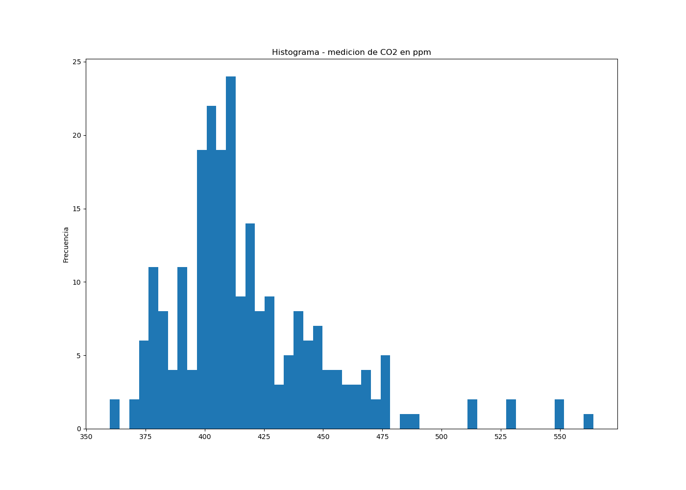

# ventila_tu_escuela
[To learn about Ventila tu Escuela visit](https://www.ventilatuescuela.org)
Visualize and analyse from the Ventila tu Escuela pilot

##Data
###Pilot 1
Ventila tu Escuela's 1st pilot is being conducted in the school Laureano Jimenez y Coria, in Ecatepec, Estado de Mexico.
This school was equiped with enough material to make one DYI air filter per classroom, and training. The school leadership provided additional resources to buy CO2 sensors. 
Since the first day of september, they are filling a form to inform about attendance, classroom ventilation and use of air filters, which is registered in the file:
*/data/VTE_air_filter_use_pilot_1.csv*
Since September 6th, they are measuring CO2 levels each day at least one time per classroom, and that gets recorded here:
*/data/pilot_1/VTE_C02_levels_pilot_1*

